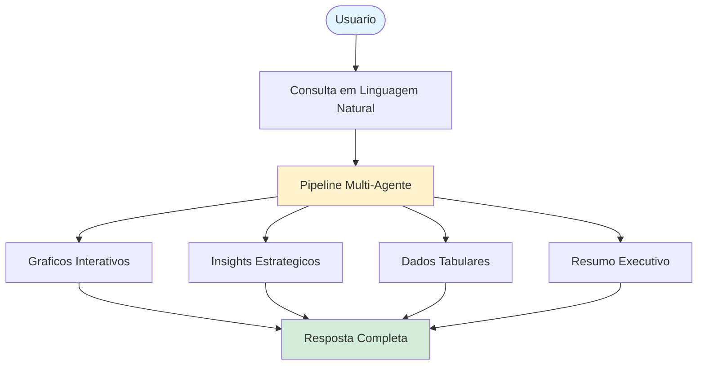
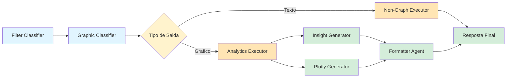
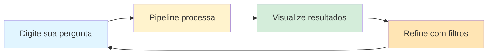

<div align="center">

# Analytics Chatbot - Pipeline Multi-Agente

### Sistema de Analise de Dados com Linguagem Natural

[](https://www.python.org/downloads/)
[](https://github.com/langchain-ai/langgraph)
[](https://streamlit.io/)
[](https://www.docker.com/)

**Converse naturalmente com seus dados e obtenha insights atraves de graficos interativos**

[Visao Geral](#-visao-geral) |
[Arquitetura](#-arquitetura) |
[Instalacao](#-instalacao) |
[Deploy](#-deploy-docker) |
[Uso](#-como-usar)

</div>

---

## Visao Geral

Sistema de chatbot empresarial que transforma consultas em linguagem natural sobre dados de vendas em visualizacoes interativas e insights estrategicos. Utiliza um pipeline multi-agente orquestrado por **LangGraph** com **Google Gemini 2.5 Flash Lite**.

### Contexto

<table>
<tr>
<td width="50%">

### Desafio
- Analise de dados requer conhecimento tecnico
- Consultas SQL complexas e demoradas
- Dificuldade em obter insights rapidos
- Visualizacoes manuais consomem tempo

</td>
<td width="50%">

### Solucao
- Interface conversacional em portugues
- Geracao automatica de graficos
- Insights estrategicos por IA
- Respostas em segundos

</td>
</tr>
</table>

---

## Funcionalidades

O sistema processa consultas de forma inteligente respondendo a diferentes necessidades:



### Capacidades

| # | Funcionalidade | Descricao | Exemplo |
|---|----------------|-----------|---------|
| 1 | **Graficos Automaticos** | 7+ tipos de visualizacao | "vendas por estado" |
| 2 | **Analise Temporal** | Comparacoes e tendencias | "evolucao mensal" |
| 3 | **Filtros Conversacionais** | Contexto persistente | "agora para SP" |
| 4 | **Insights IA** | Narrativas estrategicas | "principais conclusoes" |

---

## Arquitetura

### Pipeline de 6 Agentes

O sistema utiliza um grafo aciclico direcionado (DAG) com roteamento condicional:



### Descricao dos Agentes

<table>
<tr>
<td width="50%">

### Processamento de Entrada
- **Filter Classifier**: Extrai e gerencia filtros
- **Graphic Classifier**: Determina tipo de grafico e metricas

</td>
<td width="50%">

### Execucao e Saida
- **Analytics Executor**: Consultas SQL via DuckDB
- **Plotly Generator**: Graficos interativos
- **Insight Generator**: Narrativas estrategicas
- **Formatter Agent**: Consolidacao JSON

</td>
</tr>
</table>

### Stack Tecnologico

| Componente | Tecnologia | Versao |
|------------|------------|--------|
| Orquestracao | LangGraph | 1.0.2 |
| LLM Principal | Google Gemini | 2.5 Flash Lite |
| Analytics | DuckDB | 1.3.2 |
| Visualizacao | Plotly | 5.18.0 |
| Interface | Streamlit | 1.49.1 |
| Runtime | Python | 3.11-3.12 |

---

## Instalacao

### Pre-requisitos

- **Python 3.11 ou 3.12** (3.13 nao suportado)
- **API Key**: Google Gemini

### Instalacao Local

```bash
# 1. Clone o repositorio
git clone https://github.com/target-solucoes/analytics-chatbot.git
cd analytics-chatbot

# 2. Crie ambiente virtual
python -m venv .venv

# Windows
.venv\Scripts\activate

# Linux/Mac
source .venv/bin/activate

# 3. Instale dependencias
pip install -e .

# 4. Configure variaveis de ambiente
cp .env.example .env
# Edite .env com sua GEMINI_API_KEY
```

### Configuracao

Edite o arquivo `.env`:

```bash
# API Key obrigatoria
GEMINI_API_KEY=your-gemini-api-key-here

# Opcional: Supabase para logging
# SUPABASE_URL=https://your-project.supabase.co
# SUPABASE_API_KEY=your-supabase-key
```

---

## Deploy Docker

### Arquitetura Docker

A imagem Docker e **autossuficiente**:
- Dataset embutido durante o build
- Configuracao via variavel de ambiente
- Deploy com comando unico

### Execucao Rapida

<table>
<tr>
<td width="30px">1</td>
<td><b>Configurar</b><br/><code>cp .env.example .env</code> e adicione sua GEMINI_API_KEY</td>
</tr>
<tr>
<td>2</td>
<td><b>Build</b><br/><code>docker-compose up --build</code></td>
</tr>
<tr>
<td>3</td>
<td><b>Acessar</b><br/><a href="http://localhost:8501">http://localhost:8501</a></td>
</tr>
</table>

### Deploy Producao (GHCR)

```bash
# Pull da imagem
docker pull ghcr.io/target-solucoes/analytics-chatbot:latest

# Executar
docker run -d \
  --name analytics-chatbot \
  -p 8501:8501 \
  -e GEMINI_API_KEY=your-key \
  ghcr.io/target-solucoes/analytics-chatbot:latest
```

### Health Check

```bash
curl http://localhost:8501/_stcore/health
```

---

## Como Usar

### Executando a Aplicacao

```bash
# Via Streamlit (desenvolvimento)
streamlit run app.py

# Via Docker (producao)
docker-compose up -d
```

### Exemplos de Consultas

<table>
<tr>
<td width="50%">

### Graficos e Visualizacoes
- "top 5 clientes por vendas"
- "vendas por estado em 2024"
- "evolucao mensal de faturamento"
- "participacao por categoria"

</td>
<td width="50%">

### Analises Comparativas
- "produtos com maior crescimento"
- "comparar maio e junho"
- "queda de vendas por regiao"
- "tendencia dos ultimos 6 meses"

</td>
</tr>
</table>

### Fluxo de Uso



---

## Estrutura do Projeto

```
analytics-chatbot/
|-- app.py                      # Entry point Streamlit
|-- Dockerfile                  # Build da imagem
|-- docker-compose.yml          # Orquestracao local
|-- pyproject.toml              # Dependencias
|
|-- src/
|   |-- filter_classifier/      # Agente 1: Filtros
|   |-- graphic_classifier/     # Agente 2: Classificacao
|   |-- analytics_executor/     # Agente 3: SQL/DuckDB
|   |-- non_graph_executor/     # Agente 3-alt: Texto
|   |-- insight_generator/      # Agente 4: Insights IA
|   |-- plotly_generator/       # Agente 5: Graficos
|   |-- formatter_agent/        # Agente 6: JSON final
|   |-- shared_lib/             # Utils e configs
|   |-- pipeline_orchestrator.py # Orquestracao central
|   +-- auth/                   # Autenticacao
|
|-- streamlit_app/              # Componentes UI
|-- data/
|   |-- datasets/               # Arquivos Parquet
|   +-- mappings/               # Aliases semanticos
|
+-- .github/workflows/          # CI/CD
```

---

## Sistema de Aliases Semanticos

### Diferencial Tecnico

O sistema utiliza um dicionario de aliases (`data/mappings/alias.yaml`) para mapear termos em linguagem natural para colunas do banco de dados com **99%+ de precisao**.

### Exemplo de Mapeamento

```yaml
columns:
  Valor_Vendido:
    - "vendas"
    - "faturamento"
    - "receita"
    - "valor total"

  UF_Cliente:
    - "estado"
    - "UF"
    - "estados"
```

### Beneficios

| Aspecto | Tradicional | Nossa Solucao |
|---------|-------------|---------------|
| Precisao | ~70% | 99%+ |
| Alucinacoes | Frequentes | Zero |
| Manutencao | Codigo | YAML |
| Custo | Alto | Baixo |

---

## Comandos Uteis

### Desenvolvimento

```bash
# Executar testes
pytest

# Testes com cobertura
pytest --cov=src --cov-report=html

# Logs verbose
export LOG_LEVEL=DEBUG
streamlit run app.py
```

### Docker

```bash
# Build local
docker-compose build

# Logs
docker-compose logs -f analytics-chatbot

# Restart
docker-compose restart

# Limpar
docker-compose down --rmi all
```

---

## Troubleshooting

### Problemas Comuns

| Problema | Solucao |
|----------|---------|
| Python 3.13 | Use Python 3.11 ou 3.12 |
| API Key invalida | Verifique GEMINI_API_KEY no .env |
| Porta em uso | Altere porta no docker-compose.yml |
| Build falha | Verifique conexao e dependencias |

### Verificar Configuracao

```bash
# Verificar variavel carregada
docker-compose exec analytics-chatbot env | grep GEMINI

# Testar health
curl -f http://localhost:8501/_stcore/health
```

---

## Documentacao Adicional

- **Deploy completo**: [DEPLOY.md](DEPLOY.md)
- **Especificacoes de graficos**: [data/output_examples/README.md](data/output_examples/README.md)
- **Aliases semanticos**: [data/mappings/alias.yaml](data/mappings/alias.yaml)

---

<div align="center">

### Transformando Dados em Decisoes

**Analise inteligente com linguagem natural**

---

**Desenvolvido por Target Solucoes**

[Voltar ao topo](#analytics-chatbot---pipeline-multi-agente)

</div>
